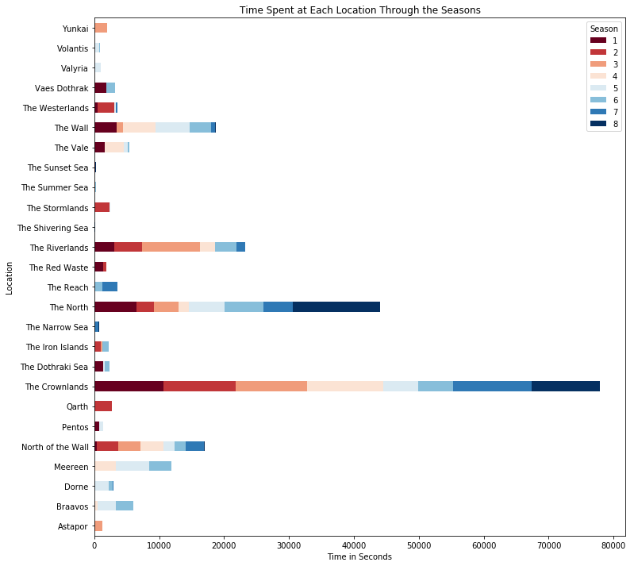

# Game Of Thrones Data Visualization
Conner Wallace
University of Washington 2022
_________________________________________________
## About the Project
This was the final project for my introduction to Data Science course (CSE 180). The task was to find a data set that interested you and create a meaningful visualization out of it. Given that the Game of Thrones series was coming to an end at the time, I decided to make a related visualization. The graph shows the time spent in seconds at all the various locations throughout the season. I chose a stacked horizontal bar chart because I liked how it showed the discrepancies in time spent throughout the seasons. 

Data Source: https://github.com/jeffreylancaster/game-of-thrones/tree/master/data
_________________________________________________
## Algorithm / Tech Used
This project was done in JupyterLabs using python. Python packages include seaborn, pandas, and numpy. 
The data set had much more than what was needed to create this graph so I created a new dataframe with columns ['Season', 'Location', 'Time Spent']. After, I went through the json file episode by episode, scene by scene and gathered the location, time spent and season. The trickiest part was implementing a way to handle the case where the location was being revisited in the same season more than once. This was handled with a simple if statement. 

Finally, after the data was cleaned I moved everything to a pivot dataframe in order to make the horizontal bar chart. After this all that was left to do was set the lables, title, and make the plot.
_________________________________________________
## The Visualization

